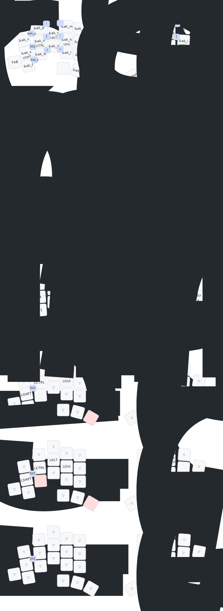

# bernelius's zmk-config

This is my personal [ZMK firmware](https://github.com/zmkfirmware/zmk/)
configuration, based on urob's [zmk-config](https://github.com/urob/zmk-config).

Urob's readme contains a lot more details, and a great local build environment
setup.

## Keymap

Only the totem keymap is current.

My keymap is based on
[HD Promethium](https://cyanophage.github.io/#handsdown-promethium), with a few
changes.

- I (mostly) inverted the alphas on top and bottom rows, since I find bottom row
  more comfortable.
- F and V have not been swapped, to avoid scissors for vw (vim: visual word).
- P and W have not been swapped, to avoid scissors for dw (vim: delete word).
- X and J have also not been swapped, to keep the hjkl (vim: left down up right)
  keys in a logical order.

This does sadly eliminate the humorous FaPDeLuXe top row, but sacrifices had to
be made for the sake of ergonomics.

I use urob's [adaptive-key](https://github.com/urob/adaptive-key) quite
extensively in combination with dead keys (F21, F22, F23, F24) to produce some
tweaked logic.

## Special keys

### DEAD1 SEMI

- This key produces DEAD1 (F21) when tapped once. if DEAD1 was the prior key
  (i.e. double tapped), it produces semicolon. If DEAD2 was the prior key,
  caps_word.

### DEAD2 COMMA

- This key produces DEAD2 (F22) when tapped once. if DEAD2 was the prior key
  (i.e. double tapped), it produces comma. If DEAD1 was the prior key,
  caps_word.

Other keys react to these keys to provide capital letters. If space or enter are
pressed, the symbol (semicolon or comma) is produced.

### DEAD3

- This key is only produced when pressing enter or space after punctuation. It
  capitalizes the next letter.
- Originally I used sticky shift for this, but it would shift symbols as well.
  dot space dot would produce ". :"

### Adaptive repeat

Left thumb 3 is a key-repeat for the pinky alphas, except V.

- This eliminates the awkward same finger bigrams of ss and cc that occur quite
  often in English. However, it leaves us with another problem with ssr (ex:
  classroom, crossroads) and ccr (ex: accrue, accredit), which now require two
  presses of the left thumb on two different keys.
- This is solved by sending a special dead key after the key-repeat, which can 
  be consumed by another key repeat, producing r. 
  Thus, s repeat repeat produces ssr, and c repeat repeat produces ccr.
- The key also cancels caps_word when not used as a repeat key.

